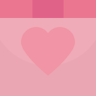
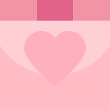
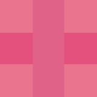

# DrawCube
用Canvas绘制正方体，其中三个面可用纯色或者图片，可以设定立方体的宽和高，最终返回生成好的Canvas元素。

## Function Description
```javascript
/**
 * 绘制正方体
 * @param  {Number} l   宽
 * @param  {Number} h   高
 * @param  {String|Object} key 颜色代码或三个面的图片
 * @return {Canvas Element}    生成好的Canvas元素
 */
function drawCube(l, h, key) {···}
```

## Usage
####引入drawCube.js
```html
<script src="drawCube.js"></script>
```
####HTML结构
```html
<canvas width="800" height="300" id="canvas"></canvas>



```
####使用纯色绘制
```javascript
drawCube(100, 100, "#7A0004");
```
####使用图片绘制
```javascript
var left = document.getElementById("left");
var right = document.getElementById("right");
var top = document.getElementById("top");
drawCube(100, 100, {left: left, right: right, top: top});
```
## Final

